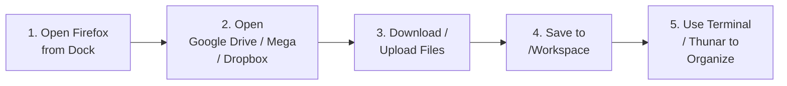

<p align="center">
  
</p>

<h1 align="center">☁️ CloudDesk RDP</h1>

<p align="center">
  <b>Lightweight Linux RDP Workspace for Railway</b> <br/>
  <i>Firefox + XFCE + XRDP — Minimal, Fast & Production-Ready for 1GB RAM / 1 vCPU</i>
</p>

<p align="center">
  <a href="#-deploy-to-railway"></a>
  <a href="https://www.docker.com/"></a>
  <a href="https://ubuntu.com/"></a>
</p>

<p align="center">
  
  
  
  
  
  
</p>

<p align="center">
  <a href="#-features">Features</a> •
  <a href="#-quick-start">Quick Start</a> •
  <a href="#-login">Login</a> •
  <a href="#-persistent-storage">Storage</a> •
  <a href="#-performance-tips">Performance</a> •
  <a href="#-license">License</a>
</p>

---

> **One Simple Workflow:** Use **Firefox** for cloud storage & web work → Use **Terminal** for file operations → Keep everything else out. No bloat, no background services, just speed.

### ✨ Why CloudDesk?

Unlike heavy Ubuntu desktop images, CloudDesk is **deliberately minimal**. It gives you a usable XFCE desktop that actually runs well on Railway's smallest plan (**1 GB RAM / 1 vCPU target**) without wasting resources on LibreOffice, media suites, databases or Redis.

| | Heavy Desktops | ☁️ CloudDesk RDP |
| :--- | :--- | :--- |
| **RAM Usage (idle)** | ~800MB - 1.2GB | **~280MB - 400MB** |
| **Boot Time** | 45s - 90s | **~8s - 15s** |
| **Image Size** | 2GB - 4GB | **~600MB - 900MB** |
| **Background Services** | 10+ | **Zero (on-demand only)** |

> ⚠️ **Note:** Modern websites & Firefox can still be heavy. This is a *target*, not a guarantee. If you open 20 tabs of heavy sites, upgrade your Railway resources.

---

## 📚 Table of Contents

- [🚀 Features](#-features)
- [🧱 Tech Stack](#-tech-stack)
- [⚡ Quick Start - Deploy to Railway](#-quick-start---deploy-to-railway)
- [🔐 Login Credentials](#-login-credentials)
- [💾 Persistent Storage](#-persistent-storage)
- [📂 File Operations Cheatsheet](#-file-operations-cheatsheet)
- [☁️ Cloud Workflow](#️-cloud-workflow)
- [⚙️ Adding Extra Apps](#️-adding-extra-apps)
- [🚀 Performance Tips](#-performance-tips)
- [📁 Project Structure](#-project-structure)
- [🔒 Security Best Practices](#-security-best-practices)
- [🤝 Contributing](#-contributing)
- [📜 License](#-license)
- [🙏 Acknowledgements](#-acknowledgements)

---

## 🚀 Features

<table>
<tr>
<td width="50%">

#### 🖥️ Desktop Experience
- **XFCE 4** — Ultra-lightweight desktop
- **Plank Dock** — macOS-inspired vertical dock
- **Thunar** — Fast graphical file manager
- **Compositing Disabled** — Max performance

</td>
<td width="50%">

#### 🌐 Work Ready
- **Firefox ESR** — Optimized for cloud storage
- **XRDP + Xorg** — Native Windows RDP support
- **Full `sudo` access** — Install anything
- **ZIP / 7-Zip, curl, wget, htop** pre-installed

</td>
</tr>
<tr>
<td>

#### 📦 Minimal by Design
- No LibreOffice / Media Suites
- No IDEs / Databases / Redis
- No background-heavy services
- Keeps image small & fast

</td>
<td>

#### 🔧 Developer Friendly
- `nano`, `less`, `htop`, network tools
- Persistent Volume ready
- Dockerfile at root - easy to fork
- Clean `start.sh` startup script

</td>
</tr>
</table>

---

## 🧱 Tech Stack

| Component | Technology | Purpose |
| :--- | :--- | :--- |
| **Base OS** | `Ubuntu 24.04 LTS` | Stable & lightweight base |
| **Desktop** | `XFCE 4` | Low-RAM desktop environment |
| **Browser** | `Firefox ESR` | Main work application |
| **Remote Access** | `XRDP + Xorg` | Windows Remote Desktop Protocol |
| **Dock** | `Plank` | App launcher |
| **File Manager** | `Thunar` | GUI file operations |
| **Container** | `Docker` | Railway deployment |

---

## ⚡ Quick Start — Deploy to Railway

### Prerequisites
- A [Railway](https://railway.app) account
- A [GitHub](https://github.com) account
- Windows PC with Remote Desktop Connection (`mstsc`)

### 1️⃣ Fork & Push to GitHub

Your repository **root must contain** exactly these files:

```
CloudDesk-RDP/
├── Dockerfile      ← Must be capital 'D'
├── start.sh
└── README.md
```

> Push to GitHub. Railway auto-detects the `Dockerfile` at the root.

### 2️⃣ Create Railway Service

1. Open [Railway Dashboard](https://railway.app/dashboard) → **New Project**
2. Select **Deploy from GitHub repo**
3. Choose your `CloudDesk-RDP` repository
4. Wait for Docker build to complete ✅

### 3️⃣ Expose RDP (TCP Proxy)

1. In Railway, open your Service → **Settings** → **Networking**
2. Click **+ Add Domain** → **TCP Proxy**
3. Set Internal Port to:
   ```
   3389
   ```
4. Railway will generate a public endpoint like:
   ```
   monorail.proxy.rlwy.net:12345
   ```
   Copy this `HOST:PORT`!

### 4️⃣ Connect from Windows

1. Press `Win + R` → type `mstsc` → Enter
2. Enter the Railway TCP address:
   ```
   monorail.proxy.rlwy.net:12345
   ```
3. Login with credentials below 👇
4. Enjoy your cloud desktop! 🎉

<p align="center">
  
</p>

---

## 🔐 Login Credentials

<table align="center">
<tr>
<td align="center">

### Default Login
| Field | Value |
| :--- | :--- |
| **Username** | `ubuntu` |
| **Password** | `1122` |

</td>
<td align="center">

### 🔒 Change Password (Recommended!)

Set in Railway → **Variables**:

```env
RDP_PASSWORD=Your_Str0ng_P@ss!
```

> ⚠️ **Never commit real passwords to GitHub!**

</td>
</tr>
</table>

<details>
<summary><b>🔧 How to change password manually (inside RDP)?</b></summary>

```bash
passwd
# or with sudo
sudo passwd ubuntu
```

</details>

---

## 💾 Persistent Storage

> **Important:** Container storage is **ephemeral**. Files outside a Volume will be lost on redeploy!

### Setup Railway Volume (One-Time)

1. In Railway Service → **Volumes** → **New Volume**
2. Mount Path:
   ```
   /home/ubuntu/Workspace
   ```
3. Redeploy.

### Recommended Structure

```
/home/ubuntu/Workspace/
├── 📁 Downloads/      # Browser downloads
├── 📁 Uploads/        # Files to upload
├── 📁 Projects/       # Your work
└── 📁 Shared/         # Anything important
```

**Pro Tip:** Change Firefox download location to `/home/ubuntu/Workspace/Downloads`!

---

## 📂 File Operations Cheatsheet

Run these in **Terminal** inside the RDP:

| Task | Command |
| :--- | :--- |
| List files (detailed) | `ls -lah` |
| Move / Rename | `mv old-name new-name` |
| Copy to Workspace | `cp file /home/ubuntu/Workspace/` |
| Extract ZIP | `unzip file.zip` |
| Create ZIP | `zip -r archive.zip folder/` |
| Extract 7z | `7z x file.7z` |
| Disk usage | `df -h` |
| RAM usage | `free -h` |
| Process manager | `htop` |
| Edit file | `nano filename` |
| Download file | `wget https://example.com/file.zip` |

---

## ☁️ Cloud Workflow

The intended workflow is super simple:



1.  **Open Firefox** from the left Plank dock
2.  **Open your cloud service** (Drive, OneDrive, Mega, etc.)
3.  **Upload / Download** files
4.  **Keep important files** in `/home/ubuntu/Workspace` (the Volume)
5.  **Use Terminal or Thunar** to rename, move, extract or process

No separate cloud-sync client needed!

---

## ⚙️ Adding Extra Apps

CloudDesk is minimal on purpose. Install what *you* need:

### Temporary Install (for one-off tasks)

```bash
sudo apt update
sudo apt install imagemagick   # example
sudo apt install ffmpeg
sudo apt install python3-pip
```
> Will be lost after container rebuild!

### Permanent Install (stays after redeploy)

1.  Edit `Dockerfile` → add package to `apt-get install` line:
    ```dockerfile
    RUN apt-get update && apt-get install -y \
        firefox-esr \
        xfce4 \
        imagemagick \  # <-- add here
        ffmpeg
    ```
2.  Commit & Push to GitHub
3.  Railway auto-redeploys with the new app included.

---

## 🚀 Performance Tips

For best experience on 1GB RAM:

- [x] Keep unnecessary Firefox tabs closed
- [x] Avoid heavy browser extensions
- [x] Use **one** cloud-storage tab, not 5 duplicates
- [x] Use Terminal for bulk operations (`unzip`, `cp`) instead of GUI
- [x] Keep data on Volume (`/home/ubuntu/Workspace`)
- [x] Don't install Redis / PostgreSQL unless truly needed
- [x] Monitor resources:

```bash
free -h   # RAM check
htop      # CPU & processes
df -h     # Disk space
```

> If RAM/CPU is constantly 90%+, **upgrade your Railway plan** — it's a resource limit, not a missing package issue.

---

## 📁 Project Structure

```
CloudDesk-RDP/
│
├── 📄 Dockerfile        # Main image definition (Ubuntu + XFCE + XRDP)
├── 📜 start.sh          # Startup script (starts XRDP, XFCE session)
├── 📖 README.md         # You are here
├── 📄 LICENSE           # MIT License
└── .dockerignore        # (optional) Docker ignore rules
```

---

## 🔒 Security Best Practices

| ✅ Do | ❌ Don't |
| :--- | :--- |
| Change default password via `RDP_PASSWORD` variable | Use `1122` in production/public repo |
| Use strong password (12+ chars) | Share your Railway TCP URL publicly |
| Keep Railway project **Private** if needed | Commit passwords to GitHub |
| Update packages periodically: `sudo apt update && sudo apt upgrade` | Expose VNC without password |

---

## 🤝 Contributing

Contributions are welcome! Here's how:

1.  **Fork** the repo
2.  Create a branch: `git checkout -b feature/amazing-feature`
3.  Commit: `git commit -m 'Add amazing feature'`
4.  Push: `git push origin feature/amazing-feature`
5.  Open a **Pull Request**

Please keep the core philosophy: **minimal & fast**. Don't add heavy default packages.

### Ideas for Contributions
- Performance optimizations
- Better startup scripts
- Documentation improvements
- Lightweight app suggestions

---

## 📜 License

This project is licensed under the **MIT License** — see the [LICENSE](LICENSE) file for details.

```
MIT License - You are free to use, modify, and distribute this project,
even for commercial purposes, as long as you include the original license.
```

**Copyright (c) 2026 CloudDesk RDP Contributors**

---

## 🙏 Acknowledgements

- [XFCE](https://xfce.org/) — Lightweight desktop environment
- [XRDP](http://xrdp.org/) — Open source RDP server
- [Railway](https://railway.app) — Awesome deployment platform
- [Mozilla Firefox](https://www.mozilla.org/firefox/) — ESR browser
- [Plank](https://launchpad.net/plank) — Elegant dock

---

<p align="center">
  <b>⭐ If this project helped you, please give it a Star on GitHub! ⭐</b> <br/>
  Made with ❤️ for the Railway community
</p>

<p align="center">
  
  
</p>

<p align="center">
  <sub>CloudDesk RDP • Not affiliated with Railway, Mozilla, or Canonical • Ubuntu® is a registered trademark of Canonical Ltd.</sub>
</p>
